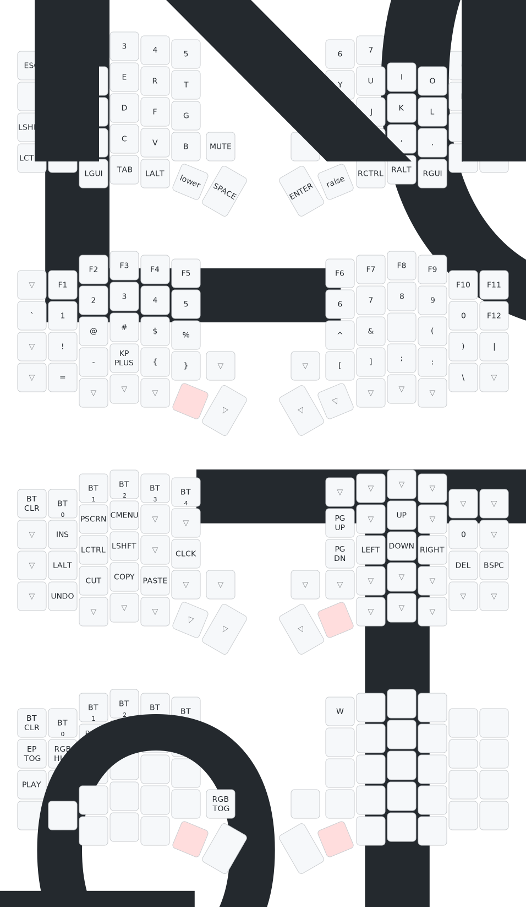

## Default keymap
The default keymap of this keyboard can be found here:

### ZMK Firmware
ZMK does provide an online [keymap editor](https://nickcoutsos.github.io/keymap-editor) and you can use this to change the keymap, this repo is already setup for the use of this editor.
